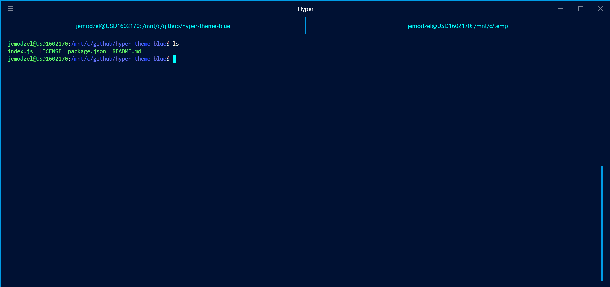
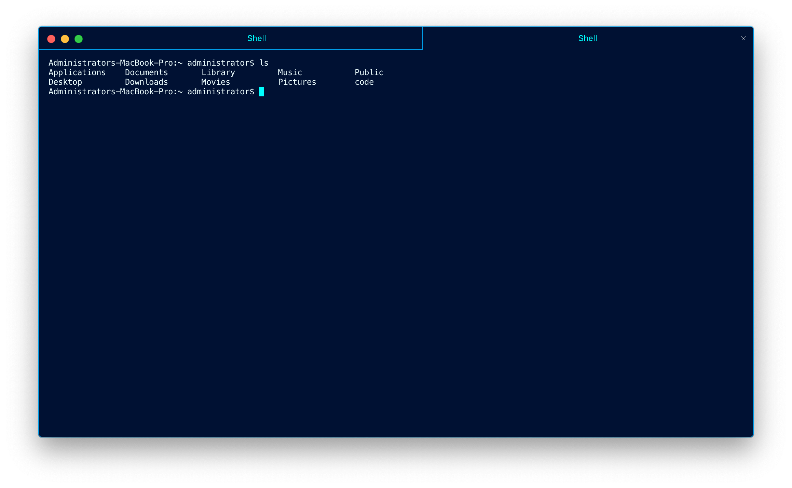

# hyper-theme-blue
Hyper terminal blue UI theme (http://hyper.js)

[](https://www.npmjs.com/package/hyper-theme-blue)

## Install

Add `hyper-theme-blue` to your plugins list on `~/.hyper.js`
```
plugins: [
    'hyper-theme-blue'
],
```



## Notes

Developed on Windows 10 (Windows Subsystem for Linux), Hyper version 2.0.0.

This is a simple theme. If you're looking to create your own grab this one and start modifying. All the magic happens in *index.js*.  For local development, create a folder in:
```
Users\your_user\.hyper_plugins\local\your_theme
```
Copy your *index.js* into the *your_theme* folder. Next update the *.hyper.js* file (should be located in Users\your_user\\.hyper.js):
```
localPlugins: [
    'your_theme'
],
```
